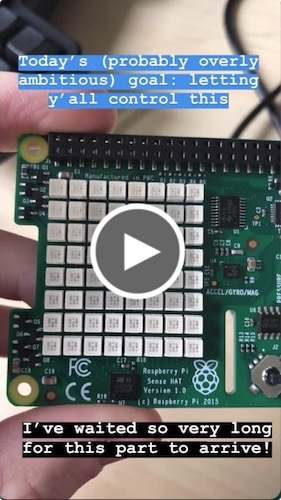

# Light Me Up

Light Me Up is a webapp to be hosted on a Raspberry Pi where drawing on the 8x8 grid on screen causes the same image to be drawn on the Pi's Sense HAT. The real fun begins when you share that link with your friends and see what "works of art" appear in your home throughout the day.

Built as a responsive vanilla JavaScript webapp where Node.js powers the backend and Socket.IO handles syncing simultaneous users to each other and the Pi.